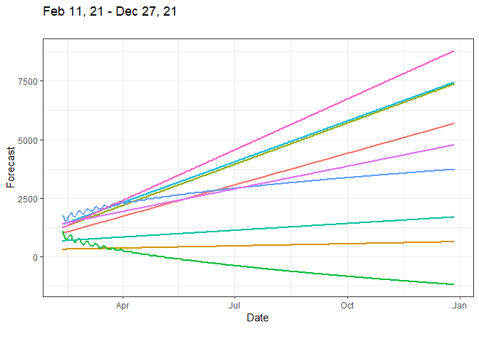
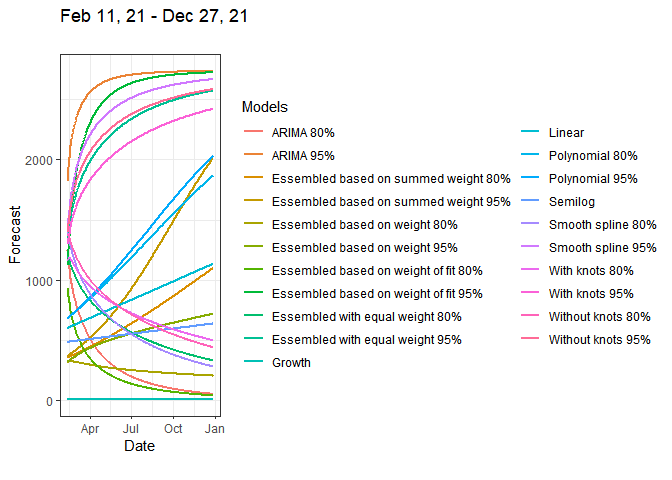

<!-- README.md is generated from README.Rmd. Please edit that file -->

# Dyn4cast

<!-- badges: start -->

[](https://ci.appveyor.com/project/JobNmadu/Dyn4cast)
[](https://cran.r-project.org/package=Dyn4cast)
[](https://travis-ci.com/JobNmadu/Dyn4cast)
[](https://codecov.io/gh/JobNmadu/Dyn4cast?branch=master)
<!-- badges: end -->

The **Dyn4cast** package is designed to be a lightweight package, with
the aim of simplifying the estimation, prediction and forecast of
time-varying dataset, especially where the data is continuously
collected on routine and regular basis. The package takes away the
efforts of loading the libraries of more than 10 packages which have
been used to develop the functions for forecasting the data.

## Installation

Although it would be possible to install the released version of
Dyn4cast from [CRAN](https://CRAN.R-project.org) in future, presently,
only the development version is available. The canonical form to do this
is:

``` r
install.packages("Dyn4cast")
```

The development version is the only one available now and can be
installed from [GitHub](https://github.com/) with:

``` r
# install.packages("devtools")
devtools::install_github("JobNmadu/Dyn4cast")
```

## Basic usage

At present, the package exports a single function, `DynamicForecast`,
which takes two required arguments: the `Data` of any recognized format
but should be a **dataframe** containing two columns `Date` and `Case`.
The Date is the *day* the data is collected while Case is the variable
for forecasting. The other arguments parsed to the function are
`MaximumDate`, which is the last date Data was collected and `BREAKS`,
which is a vector of numbers and used as `knots` in estimating spline
polynomials.

## Citation

This package can be cited as:  
Job Nmadu (2021). Dyn4cast: Dynamic Forecast of five models and their
Ensembles. R package version 11.11.00.
<https://github.com/JobNmadu/Dyn4cast>.

## Example

This is a basic example which shows you how to solve a common problem:

``` r
library(Dyn4cast)
#> Loading required package: tidyverse
#> -- Attaching packages --------------------------------------- tidyverse 1.3.0 --
#> v ggplot2 3.3.3     v purrr   0.3.4
#> v tibble  3.0.6     v dplyr   1.0.4
#> v tidyr   1.1.2     v stringr 1.4.0
#> v readr   1.4.0     v forcats 0.5.1
#> -- Conflicts ------------------------------------------ tidyverse_conflicts() --
#> x dplyr::filter() masks stats::filter()
#> x dplyr::lag()    masks stats::lag()
#> Registered S3 method overwritten by 'quantmod':
#>   method            from
#>   as.zoo.data.frame zoo
## basic example code
niz2 <- readxl::read_excel("data-raw/data/Data.xlsx")
niz2$Date <- as.Date(niz2$Date, format = '%m/%d/%Y')

Dss <- seq(niz2$Date[1], by = "day", length.out = length(niz2$Case))
lastdayfo21 <- Dss[length(Dss)]

#Dss <- seq(niz2$Date[1], by = "month", length.out = length(niz2$Case))
#lastdayfo21 <- Dss[length(Dss)] # for monthly data

#Dss <- seq(niz2$Date[1], by = "year", length.out = length(niz2$Case))
#lastdayfo21 <- Dss[length(Dss)] # for yearly data

BREAKS = c(70, 131, 173, 228, 274)
KK_28 <- niz2[niz2$Date <= lastdayfo21 - 28, ]
Days_28 <- DynamicForecast(Data = KK_28, BREAKS = BREAKS, MaximumDate = "2021-02-10", Trend = "Day")
#> Warning in RMSE91$`Ensembled with equal weight` <- Metrics::rmse(Data$Case, :
#> Coercing LHS to a list
summary(Days_28$`Ensembled based on summed weight`)
#> 
#> Call:
#> lm(formula = Data$Day ~ Without.knots + With.knots + Smooth + 
#>     Quadratic + ARIMA)
#> 
#> Residuals:
#>    Min     1Q Median     3Q    Max 
#> -52.69 -14.49   5.85  18.70  25.37 
#> 
#> Coefficients:
#>                 Estimate Std. Error t value Pr(>|t|)    
#> (Intercept)   -29.792445   2.763795 -10.780   <2e-16 ***
#> Without.knots   0.001976   0.010138   0.195   0.8456    
#> With.knots      0.002150   0.022524   0.095   0.9240    
#> Smooth         -0.029336   0.025236  -1.162   0.2459    
#> Quadratic       0.568967   0.009350  60.852   <2e-16 ***
#> ARIMA           0.026473   0.012757   2.075   0.0388 *  
#> ---
#> Signif. codes:  0 '***' 0.001 '**' 0.01 '*' 0.05 '.' 0.1 ' ' 1
#> 
#> Residual standard error: 21.12 on 314 degrees of freedom
#> Multiple R-squared:  0.9487, Adjusted R-squared:  0.9479 
#> F-statistic:  1162 on 5 and 314 DF,  p-value: < 2.2e-16

knitr::kable(as.data.frame(Days_28$Forecast), row.names = FALSE, "html")
```

<table>
<thead>
<tr>
<th style="text-align:left;">
Model
</th>
<th style="text-align:left;">
Case
</th>
</tr>
</thead>
<tbody>
<tr>
<td style="text-align:left;">
Without knots
</td>
<td style="text-align:left;">
1606956
</td>
</tr>
<tr>
<td style="text-align:left;">
Smooth Spline
</td>
<td style="text-align:left;">
1414254
</td>
</tr>
<tr>
<td style="text-align:left;">
With knots
</td>
<td style="text-align:left;">
991316
</td>
</tr>
<tr>
<td style="text-align:left;">
Quadratic Polynomial
</td>
<td style="text-align:left;">
380508
</td>
</tr>
<tr>
<td style="text-align:left;">
Lower ARIMA
</td>
<td style="text-align:left;">
-126404
</td>
</tr>
<tr>
<td style="text-align:left;">
Upper ARIMA
</td>
<td style="text-align:left;">
939766
</td>
</tr>
<tr>
<td style="text-align:left;">
Ensembled with equal weight
</td>
<td style="text-align:left;">
1381412
</td>
</tr>
<tr>
<td style="text-align:left;">
Ensembled based on weight
</td>
<td style="text-align:left;">
153587
</td>
</tr>
<tr>
<td style="text-align:left;">
Ensembled based on summed weight
</td>
<td style="text-align:left;">
210948
</td>
</tr>
<tr>
<td style="text-align:left;">
Ensembled based on weight of fit
</td>
<td style="text-align:left;">
1072054
</td>
</tr>
</tbody>
</table>

``` r
knitr::kable(as.data.frame(Days_28$RMSE), row.names = FALSE, "html")
```

<table>
<thead>
<tr>
<th style="text-align:left;">
Models
</th>
<th style="text-align:left;">
RMSE
</th>
</tr>
</thead>
<tbody>
<tr>
<td style="text-align:left;">
Without knots
</td>
<td style="text-align:left;">
221.72
</td>
</tr>
<tr>
<td style="text-align:left;">
Smooth Spline
</td>
<td style="text-align:left;">
171.18
</td>
</tr>
<tr>
<td style="text-align:left;">
With knots
</td>
<td style="text-align:left;">
153.91
</td>
</tr>
<tr>
<td style="text-align:left;">
Quadratic Polynomial
</td>
<td style="text-align:left;">
305.21
</td>
</tr>
<tr>
<td style="text-align:left;">
Lower ARIMA
</td>
<td style="text-align:left;">
169.16
</td>
</tr>
<tr>
<td style="text-align:left;">
Upper ARIMA
</td>
<td style="text-align:left;">
169.16
</td>
</tr>
<tr>
<td style="text-align:left;">
Ensembled with equal weight
</td>
<td style="text-align:left;">
175.47
</td>
</tr>
<tr>
<td style="text-align:left;">
Ensembled based on weight
</td>
<td style="text-align:left;">
358.35
</td>
</tr>
<tr>
<td style="text-align:left;">
Ensembled based on summed weight
</td>
<td style="text-align:left;">
357.6
</td>
</tr>
<tr>
<td style="text-align:left;">
Ensembled based on weight of fit
</td>
<td style="text-align:left;">
193.35
</td>
</tr>
</tbody>
</table>

``` r
Days_28$Plot
```



``` r
KK_14 <- niz2[niz2$Date <= lastdayfo21 - 14, ]
Days_14 <- DynamicForecast(Data = KK_28, BREAKS = BREAKS, MaximumDate = "2021-02-10", Trend = "Day")
#> Warning in RMSE91$`Ensembled with equal weight` <- Metrics::rmse(Data$Case, :
#> Coercing LHS to a list

summary(Days_14$`Ensembled based on weight`)
#> 
#> Call:
#> lm(formula = Data$Day ~ Without.knots * With.knots * Smooth * 
#>     Quadratic * ARIMA)
#> 
#> Residuals:
#>      Min       1Q   Median       3Q      Max 
#> -2.40756 -0.27694  0.01625  0.33327  1.21293 
#> 
#> Coefficients:
#>                                                   Estimate Std. Error t value
#> (Intercept)                                     -9.663e+01  1.056e+00 -91.504
#> Without.knots                                    1.104e-01  3.912e-03  28.234
#> With.knots                                       4.897e-01  2.065e-02  23.708
#> Smooth                                           5.164e-02  4.559e-02   1.133
#> Quadratic                                        7.565e-01  6.557e-03 115.365
#> ARIMA                                            5.070e-02  3.897e-02   1.301
#> Without.knots:With.knots                        -8.185e-04  5.943e-05 -13.773
#> Without.knots:Smooth                            -2.683e-04  1.407e-04  -1.907
#> With.knots:Smooth                               -6.046e-04  5.376e-05 -11.245
#> Without.knots:Quadratic                         -5.433e-04  2.499e-05 -21.744
#> With.knots:Quadratic                            -5.424e-04  4.139e-05 -13.104
#> Smooth:Quadratic                                -8.862e-05  1.078e-04  -0.822
#> Without.knots:ARIMA                             -1.261e-04  1.195e-04  -1.055
#> With.knots:ARIMA                                -5.657e-04  6.689e-05  -8.457
#> Smooth:ARIMA                                     6.683e-04  1.300e-04   5.141
#> Quadratic:ARIMA                                 -1.063e-04  9.125e-05  -1.165
#> Without.knots:With.knots:Smooth                  1.432e-06  1.591e-07   9.003
#> Without.knots:With.knots:Quadratic               1.245e-06  9.903e-08  12.570
#> Without.knots:Smooth:Quadratic                   7.278e-07  3.540e-07   2.056
#> With.knots:Smooth:Quadratic                      4.997e-07  1.063e-07   4.699
#> Without.knots:With.knots:ARIMA                   1.104e-06  2.030e-07   5.435
#> Without.knots:Smooth:ARIMA                      -1.251e-06  3.333e-07  -3.752
#> With.knots:Smooth:ARIMA                          3.200e-07  6.918e-08   4.625
#> Without.knots:Quadratic:ARIMA                    5.142e-07  3.180e-07   1.617
#> With.knots:Quadratic:ARIMA                       5.112e-07  1.514e-07   3.377
#> Smooth:Quadratic:ARIMA                          -1.368e-06  3.244e-07  -4.216
#> Without.knots:With.knots:Smooth:Quadratic       -2.026e-09  2.397e-10  -8.450
#> Without.knots:With.knots:Smooth:ARIMA           -6.857e-10  2.374e-10  -2.889
#> Without.knots:With.knots:Quadratic:ARIMA        -1.593e-09  2.984e-10  -5.337
#> Without.knots:Smooth:Quadratic:ARIMA             2.521e-09  8.301e-10   3.037
#> With.knots:Smooth:Quadratic:ARIMA               -1.452e-10  1.023e-10  -1.420
#> Without.knots:With.knots:Smooth:Quadratic:ARIMA  4.864e-13  4.456e-13   1.092
#>                                                 Pr(>|t|)    
#> (Intercept)                                      < 2e-16 ***
#> Without.knots                                    < 2e-16 ***
#> With.knots                                       < 2e-16 ***
#> Smooth                                          0.258274    
#> Quadratic                                        < 2e-16 ***
#> ARIMA                                           0.194279    
#> Without.knots:With.knots                         < 2e-16 ***
#> Without.knots:Smooth                            0.057580 .  
#> With.knots:Smooth                                < 2e-16 ***
#> Without.knots:Quadratic                          < 2e-16 ***
#> With.knots:Quadratic                             < 2e-16 ***
#> Smooth:Quadratic                                0.411688    
#> Without.knots:ARIMA                             0.292367    
#> With.knots:ARIMA                                1.39e-15 ***
#> Smooth:ARIMA                                    5.04e-07 ***
#> Quadratic:ARIMA                                 0.245144    
#> Without.knots:With.knots:Smooth                  < 2e-16 ***
#> Without.knots:With.knots:Quadratic               < 2e-16 ***
#> Without.knots:Smooth:Quadratic                  0.040712 *  
#> With.knots:Smooth:Quadratic                     4.06e-06 ***
#> Without.knots:With.knots:ARIMA                  1.17e-07 ***
#> Without.knots:Smooth:ARIMA                      0.000212 ***
#> With.knots:Smooth:ARIMA                         5.66e-06 ***
#> Without.knots:Quadratic:ARIMA                   0.106958    
#> With.knots:Quadratic:ARIMA                      0.000833 ***
#> Smooth:Quadratic:ARIMA                          3.33e-05 ***
#> Without.knots:With.knots:Smooth:Quadratic       1.47e-15 ***
#> Without.knots:With.knots:Smooth:ARIMA           0.004163 ** 
#> Without.knots:With.knots:Quadratic:ARIMA        1.91e-07 ***
#> Without.knots:Smooth:Quadratic:ARIMA            0.002610 ** 
#> With.knots:Smooth:Quadratic:ARIMA               0.156591    
#> Without.knots:With.knots:Smooth:Quadratic:ARIMA 0.275893    
#> ---
#> Signif. codes:  0 '***' 0.001 '**' 0.01 '*' 0.05 '.' 0.1 ' ' 1
#> 
#> Residual standard error: 0.5601 on 288 degrees of freedom
#> Multiple R-squared:      1,  Adjusted R-squared:      1 
#> F-statistic: 2.808e+05 on 31 and 288 DF,  p-value: < 2.2e-16

knitr::kable(as.data.frame(Days_14$Forecast), row.names = FALSE, "html")
```

<table>
<thead>
<tr>
<th style="text-align:left;">
Model
</th>
<th style="text-align:left;">
Case
</th>
</tr>
</thead>
<tbody>
<tr>
<td style="text-align:left;">
Without knots
</td>
<td style="text-align:left;">
1606956
</td>
</tr>
<tr>
<td style="text-align:left;">
Smooth Spline
</td>
<td style="text-align:left;">
1414254
</td>
</tr>
<tr>
<td style="text-align:left;">
With knots
</td>
<td style="text-align:left;">
991316
</td>
</tr>
<tr>
<td style="text-align:left;">
Quadratic Polynomial
</td>
<td style="text-align:left;">
380508
</td>
</tr>
<tr>
<td style="text-align:left;">
Lower ARIMA
</td>
<td style="text-align:left;">
-126404
</td>
</tr>
<tr>
<td style="text-align:left;">
Upper ARIMA
</td>
<td style="text-align:left;">
939766
</td>
</tr>
<tr>
<td style="text-align:left;">
Ensembled with equal weight
</td>
<td style="text-align:left;">
1381412
</td>
</tr>
<tr>
<td style="text-align:left;">
Ensembled based on weight
</td>
<td style="text-align:left;">
153587
</td>
</tr>
<tr>
<td style="text-align:left;">
Ensembled based on summed weight
</td>
<td style="text-align:left;">
210948
</td>
</tr>
<tr>
<td style="text-align:left;">
Ensembled based on weight of fit
</td>
<td style="text-align:left;">
1072054
</td>
</tr>
</tbody>
</table>

``` r
knitr::kable(as.data.frame(Days_14$RMSE), row.names = FALSE, "html")
```

<table>
<thead>
<tr>
<th style="text-align:left;">
Models
</th>
<th style="text-align:left;">
RMSE
</th>
</tr>
</thead>
<tbody>
<tr>
<td style="text-align:left;">
Without knots
</td>
<td style="text-align:left;">
221.72
</td>
</tr>
<tr>
<td style="text-align:left;">
Smooth Spline
</td>
<td style="text-align:left;">
171.18
</td>
</tr>
<tr>
<td style="text-align:left;">
With knots
</td>
<td style="text-align:left;">
153.91
</td>
</tr>
<tr>
<td style="text-align:left;">
Quadratic Polynomial
</td>
<td style="text-align:left;">
305.21
</td>
</tr>
<tr>
<td style="text-align:left;">
Lower ARIMA
</td>
<td style="text-align:left;">
169.16
</td>
</tr>
<tr>
<td style="text-align:left;">
Upper ARIMA
</td>
<td style="text-align:left;">
169.16
</td>
</tr>
<tr>
<td style="text-align:left;">
Ensembled with equal weight
</td>
<td style="text-align:left;">
175.47
</td>
</tr>
<tr>
<td style="text-align:left;">
Ensembled based on weight
</td>
<td style="text-align:left;">
358.35
</td>
</tr>
<tr>
<td style="text-align:left;">
Ensembled based on summed weight
</td>
<td style="text-align:left;">
357.6
</td>
</tr>
<tr>
<td style="text-align:left;">
Ensembled based on weight of fit
</td>
<td style="text-align:left;">
193.35
</td>
</tr>
</tbody>
</table>

``` r
Days_14$Plot
```



## Suggested packages

Although not a dependency, the package derives functionally from a
number of other packages ans so may require you to install such packages
if they are not yet installed. the packages are listed below:

``` r
install.packages(c("forecast", "lubridate", "Metrics", "tidyr", "ggplot2", "magrittr", "formattable", "xlsx", "readxl"))
```

## Things the package can do

The package is capable of estimation, prediction and forecasting of the
following models.  
- Spline without knots  
- Spline with knots  
- Smooth Spline  
- ARIMA  
- Quadratic  
- Ensembled with equal weight  
- Ensembled based on weight  
- Ensembled based on summed weight  
- Ensembled based on weight of fit

Note that a *warning* (not *error*) is thrown up while estimating the
RMSE for the `Ensembled with equal weight` model. It was thoroughly
investigated and causes no harm. Efforts are still on to silence the
warning, which I will soon. The warning is one of such issues that is
general to R. If you set your *chunk option* to `warning = FALSE` you
will not notice the warning.

## Other suggestions?

The package is still very much in progress as such feedback,
particularly at this developmental stage, would be greatly welcome and
appreciated.

## Code of Conduct

Please note that the Dyn4cast project is released with a [Contributor
Code of
Conduct](https://contributor-covenant.org/version/2/0/CODE_OF_CONDUCT.html).
By contributing to this project, you agree to abide by its terms.

[](https://app.netlify.com/sites/jobnmadu/deploys)
