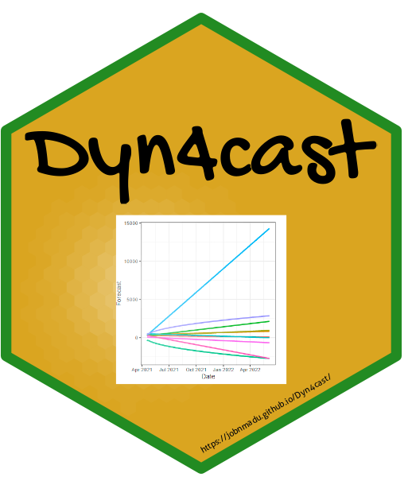

<!-- README.md is generated from README.Rmd. Please edit that file -->

# Dyn4cast 

<!-- badges: start -->

[](https://github.com/JobNmadu/Dyn4cast/actions/workflows/R-CMD-check.yaml)

[](https://jobnmadu.r-universe.dev/)

[](https://jobnmadu.r-universe.dev/)

[](https://github.com/JobNmadu/Dyn4cast/releases)

[](https://app.codecov.io/gh/JobNmadu/Dyn4cast)

<!--
[](https://app.codecov.io/gh/JobNmadu/Dyn4cast)
&#10;[](https://lifecycle.r-lib.org/articles/stages.html#stable)
&#10;-->

[](https://www.repostatus.org/#active)

<!-- badges: end -->

The **Dyn4cast** package is designed to be a lightweight package. The
philosophy behind it was the need to provide quick updates and
visualization of Nigerian *COVID-19* cases during the pandemic in 2020,
hence had only one function, **DynamicForecast**. The aim was to
simplify the estimation, prediction and forecast of time-varying
*COVID-19* dataset, based on daily update of incidences. There was need
to have a function which is able to handle continuous data collection,
estimation and forecast. That was what led to the name of the package.
From that single function, the number of functions have grown to more
than 10 because there were need to have supporting functions to make the
forecasting easy. However, the package has pride itself of the *line
line technology* by providing various **machine learning functions**
that have the functionality of revealing the facts behind your data. The
functions are working optimally and efforts are continuously being made
to improve on them and ensuring that dependencies are reduced to the
barest minimum. The unique selling point of this package is that it
takes away the need to load multiple libraries to perform the various
machine learning tasks.

## Installation

The released version of *Dyn4cast* can be installed from
[CRAN](https://cran.r-project.org/web/packages/Dyn4cast/index.html). The
canonical form for
[CRAN](https://cran.r-project.org/web/packages/Dyn4cast/index.html) is:

    install.packages("Dyn4cast")

The development version is available now and can be installed from
[GitHub](https://github.com/JobNmadu/Dyn4cast) with:

``` r
# install.packages("devtools")
pak::pak("JobNmadu/Dyn4cast")
```

The development version can also be installed through
[r-universe](https://jobnmadu.r-universe.dev/Dyn4cast). Use the form:

``` r
install.packages("Dyn4cast", repos = c("https://jobnmadu.r-universe.dev", "https://cloud.r-project.org"))
```

## Basic usage

At present, the package exports the following functions:

1.  `DynamicForecast` which takes two required arguments: the `Data` of
    any recognized format but should be a **dataframe** containing two
    columns `Date` and `Case`. The Date is the *day/month/year* the data
    is collected while Case is the variable for forecasting. The Date
    must be in the recognized format i.e. ‘YYYY-MM-DD’. The other
    arguments parsed to the function are `MaximumDate`, which is the
    last date Data was collected and `BREAKS`, which is a vector of
    numbers and is used as `knots` in estimating spline polynomials.

2.  `Percent` which affix the % sign on a value or a vector or data
    frame of values.

3.  `MLMetrics` which collects more than 40 metrics that are useful in
    model selection. The beauty of this function is the simplicity with
    which these metrics are collected from difference packages and saves
    the user the need to load more than 10 libraries in order to get
    these metrics.

4.  `MallowsCP` for determining the the Mallows CP.

5.  `Linearsystems` for linear regression model with some
    transformation.

6.  `quicksummary` which outputs a formatted table of useful summary
    statistics of machine learning data.

7.  `formattedcut` is a wrapper for providing publication ready
    frequency tables for continuous variable.

8.  `data_transform` is a wrapper for standardizing `data.frame` to make
    the values comparable for estimation and/or visualization.

9.  `estimate_plot` is a function for plotting estimated coefficients of
    a model in their order of significance.

10. `corplot` is for plotting the correlation matrix.

11. `garrett_ranking` is for ranking Likert-type data.

12. `Model_factors` is for determining and retrieving latent factors
    from Likert-type data for estimation and Machine Learning.

13. `treatment_model` is for propensity matching treatments effects and
    other metrics in the Machine Learning Environment.

14. `mdi` is for computation of multidimensional indicators and indices

15. `plot_mdi` is to plot the indices

16. `gender` is to convert age and sex to gender

17. `index_construction` is to convert indicators of exposure or
    sensitivity to vector of index

18. `relative_likert` converts likert scores to vector of index for
    adaptive capacity

19. `odds_summary` computes odds ratios, percentage changes, and
    confidence intervals from fitted binary and categorical regression
    models

## Citation

The citation information for this package can be obtained easily when
you run `citation("Dyn4cast")` in your `R` console.

``` r

citation("Dyn4cast")
#> To cite package 'Dyn4cast' in publications use:
#> 
#>   Nmadu J (2026). _Dyn4cast: Dynamic Modeling and Machine Learning
#>   Environment_. R package version 11.11.26, commit
#>   fe563be951b4872d11eff13601190bfaae39379f,
#>   <https://github.com/JobNmadu/Dyn4cast>.
#> 
#> A BibTeX entry for LaTeX users is
#> 
#>   @Manual{,
#>     title = {Dyn4cast: Dynamic Modeling and Machine Learning Environment},
#>     author = {Job Nmadu},
#>     year = {2026},
#>     note = {R package version 11.11.26, commit fe563be951b4872d11eff13601190bfaae39379f},
#>     url = {https://github.com/JobNmadu/Dyn4cast},
#>   }
```

## Suggested packages

Although not dependencies, the package derives functionally from a
number of other packages and so may require you to install them if not
already installed on your machine. Some of the packages are listed
below:

``` r
install.packages(c("testthat", "tidyverse", "rmarkdown", "covr"
                   "caret", "kableExtra", "knitr", "spelling", "psych",
                   "readr", "MetBrewer", "data.table", "ggtext", "lubridate",
                   "forecast", "MASS", "mlogit", "nnet", "betareg", "mvProbit",
                   "miscTools"))
```

Note that a *warning* (not *error*) is thrown up while estimating the
RMSE for the `Ensembled with equal weight` model. It was thoroughly
investigated and causes no harm. Efforts are still on to silence the
warning, which I will soon. The warning is one of such issues that is
general to R. If you set your *chunk option* to `warning = FALSE` you
will not notice the warning.

## Other suggestions?

The package is still very much in progress as such feedback,
particularly at this developmental stage, would be greatly welcome and
appreciated. Please fork your feedback at GitHub.

## Bibliography

Mahoney, M. (2021). [Model averaging methods: how and why to build
ensemble models.](https://www.mm218.dev/posts/2021/01/model-averaging/)

Hyndman, R. J. (2020). Quantile forecasting with ensembles and
combinations in *Business Forecasting: The Emerging Role of Artificial
Intelligence and Machine Learning*, eds. Gilliland, Tashman & Sglavo.
John Wiley & Sons.

Hyndman, R.J., & Athanasopoulos, G. (2021). *Forecasting: principles and
practice*, 3rd edition, OTexts: Melbourne, Australia. OTexts.com/fpp3.
Accessed on July 30, 2021.

Lucy D’Agostino McGowan (2019). Understanding propensity score
weighting. Available at:
<https://livefreeordichotomize.com/posts/2019-01-17-understanding-propensity-score-weighting/>

## Code of Conduct

Please note that the Dyn4cast project is released with a [Contributor
Code of
Conduct](https://contributor-covenant.org/version/2/0/CODE_OF_CONDUCT.html).
By contributing to this project, you agree to abide by its terms.
