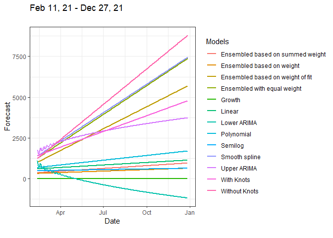

<!-- README.md is generated from README.Rmd. Please edit that file -->

# Dyn4cast

<!-- badges: start -->

[](#)
[](https://github.com/JobNmadu/Dyn4cast/actions)
[](https://codecov.io/gh/JobNmadu/Dyn4cast?branch=master)
<!-- badges: end -->

The **Dyn4cast** package is designed to be a lightweight package, with
the aim of simplifying the estimation, prediction and forecast of
time-varying daraset, especially where the data is cntining and is
routine. The package takes away the efforts of putting together a
library of more than than packages which were used to develop it.

## Installation

Althouth it would be possible to install the released version of
Dyn4cast from [CRAN](https://CRAN.R-project.org) with:

``` r
install.packages("Dyn4cast")
```

presently, only the development version is available.

And the development version from [GitHub](https://github.com/) with:

``` r
# install.packages("devtools")
devtools::install_github("JobNmadu/Dyn4cast")
```

## Example

This is a basic example which shows you how to solve a common problem:

``` r
library(Dyn4cast)
#> Loading required package: tidyverse
#> -- Attaching packages --------------------------------------- tidyverse 1.3.0 --
#> v ggplot2 3.3.3     v purrr   0.3.4
#> v tibble  3.0.6     v dplyr   1.0.4
#> v tidyr   1.1.2     v stringr 1.4.0
#> v readr   1.4.0     v forcats 0.5.1
#> -- Conflicts ------------------------------------------ tidyverse_conflicts() --
#> x dplyr::filter() masks stats::filter()
#> x dplyr::lag()    masks stats::lag()
#> Registered S3 method overwritten by 'quantmod':
#>   method            from
#>   as.zoo.data.frame zoo
## basic example code
niz2 <- readxl::read_excel("data-raw/data/Data.xlsx")
niz2$Date <- as.Date(niz2$Date, format = '%m/%d/%Y')

Dss <- seq(niz2$Date[1], by = "day", length.out = length(niz2$Case))
lastdayfo21 <- Dss[length(Dss)]

KK_28 <- niz2[niz2$Date <= lastdayfo21 - 28, ]
Days_28 <- DynamicForecast(Data = KK_28, BREAKS = c(70, 131, 173, 228, 274) , Date = "2021-02-10")
#> Warning in RMSE91$`Essembled with equal weight` <- Metrics::rmse(Data$Case, :
#> Coercing LHS to a list

knitr::kable(as.data.frame(Days_28$Forecast), row.names = FALSE, "html")
```

<table>
<thead>
<tr>
<th style="text-align:left;">
Model
</th>
<th style="text-align:left;">
Confirmed cases
</th>
</tr>
</thead>
<tbody>
<tr>
<td style="text-align:left;">
Without knots
</td>
<td style="text-align:left;">
1606956
</td>
</tr>
<tr>
<td style="text-align:left;">
Smooth Spline
</td>
<td style="text-align:left;">
1414254
</td>
</tr>
<tr>
<td style="text-align:left;">
With knots
</td>
<td style="text-align:left;">
991316
</td>
</tr>
<tr>
<td style="text-align:left;">
Quadratic Polynomial
</td>
<td style="text-align:left;">
380508
</td>
</tr>
<tr>
<td style="text-align:left;">
Lower ARIMA
</td>
<td style="text-align:left;">
-126404
</td>
</tr>
<tr>
<td style="text-align:left;">
Upper ARIMA
</td>
<td style="text-align:left;">
939766
</td>
</tr>
<tr>
<td style="text-align:left;">
Essembled with equal weight
</td>
<td style="text-align:left;">
1381412
</td>
</tr>
<tr>
<td style="text-align:left;">
Essembled based on weight of model
</td>
<td style="text-align:left;">
153587
</td>
</tr>
<tr>
<td style="text-align:left;">
Essembled based on weight of fit of each model
</td>
<td style="text-align:left;">
1072054
</td>
</tr>
</tbody>
</table>

``` r
knitr::kable(as.data.frame(Days_28$RMSE), "html")
```

<table>
<thead>
<tr>
<th style="text-align:left;">
</th>
<th style="text-align:right;">
Days\_28$RMSE
</th>
</tr>
</thead>
<tbody>
<tr>
<td style="text-align:left;">
Without knots
</td>
<td style="text-align:right;">
221.72
</td>
</tr>
<tr>
<td style="text-align:left;">
Smooth Spline
</td>
<td style="text-align:right;">
171.18
</td>
</tr>
<tr>
<td style="text-align:left;">
With knots
</td>
<td style="text-align:right;">
153.91
</td>
</tr>
<tr>
<td style="text-align:left;">
Polynomial
</td>
<td style="text-align:right;">
305.21
</td>
</tr>
<tr>
<td style="text-align:left;">
Lower ARIMA
</td>
<td style="text-align:right;">
169.16
</td>
</tr>
<tr>
<td style="text-align:left;">
Upper ARIMA
</td>
<td style="text-align:right;">
169.16
</td>
</tr>
<tr>
<td style="text-align:left;">
Essembled with equal weight
</td>
<td style="text-align:right;">
175.47
</td>
</tr>
<tr>
<td style="text-align:left;">
Essembled based on weight of model
</td>
<td style="text-align:right;">
358.35
</td>
</tr>
<tr>
<td style="text-align:left;">
Essembled based on weight of fit of each model
</td>
<td style="text-align:right;">
193.35
</td>
</tr>
</tbody>
</table>

``` r
Days_28$Plot
```



``` r
KK_14 <- niz2[niz2$Date <= lastdayfo21 - 14, ]
Days_14 <- DynamicForecast(Data = KK_28, BREAKS = c(70, 131, 173, 228, 274) , Date = "2021-02-10")
#> Warning in RMSE91$`Essembled with equal weight` <- Metrics::rmse(Data$Case, :
#> Coercing LHS to a list

knitr::kable(as.data.frame(Days_14$Forecast), row.names = FALSE, "html")
```

<table>
<thead>
<tr>
<th style="text-align:left;">
Model
</th>
<th style="text-align:left;">
Confirmed cases
</th>
</tr>
</thead>
<tbody>
<tr>
<td style="text-align:left;">
Without knots
</td>
<td style="text-align:left;">
1606956
</td>
</tr>
<tr>
<td style="text-align:left;">
Smooth Spline
</td>
<td style="text-align:left;">
1414254
</td>
</tr>
<tr>
<td style="text-align:left;">
With knots
</td>
<td style="text-align:left;">
991316
</td>
</tr>
<tr>
<td style="text-align:left;">
Quadratic Polynomial
</td>
<td style="text-align:left;">
380508
</td>
</tr>
<tr>
<td style="text-align:left;">
Lower ARIMA
</td>
<td style="text-align:left;">
-126404
</td>
</tr>
<tr>
<td style="text-align:left;">
Upper ARIMA
</td>
<td style="text-align:left;">
939766
</td>
</tr>
<tr>
<td style="text-align:left;">
Essembled with equal weight
</td>
<td style="text-align:left;">
1381412
</td>
</tr>
<tr>
<td style="text-align:left;">
Essembled based on weight of model
</td>
<td style="text-align:left;">
153587
</td>
</tr>
<tr>
<td style="text-align:left;">
Essembled based on weight of fit of each model
</td>
<td style="text-align:left;">
1072054
</td>
</tr>
</tbody>
</table>

``` r
knitr::kable(as.data.frame(Days_14$RMSE), "html")
```

<table>
<thead>
<tr>
<th style="text-align:left;">
</th>
<th style="text-align:right;">
Days\_14$RMSE
</th>
</tr>
</thead>
<tbody>
<tr>
<td style="text-align:left;">
Without knots
</td>
<td style="text-align:right;">
221.72
</td>
</tr>
<tr>
<td style="text-align:left;">
Smooth Spline
</td>
<td style="text-align:right;">
171.18
</td>
</tr>
<tr>
<td style="text-align:left;">
With knots
</td>
<td style="text-align:right;">
153.91
</td>
</tr>
<tr>
<td style="text-align:left;">
Polynomial
</td>
<td style="text-align:right;">
305.21
</td>
</tr>
<tr>
<td style="text-align:left;">
Lower ARIMA
</td>
<td style="text-align:right;">
169.16
</td>
</tr>
<tr>
<td style="text-align:left;">
Upper ARIMA
</td>
<td style="text-align:right;">
169.16
</td>
</tr>
<tr>
<td style="text-align:left;">
Essembled with equal weight
</td>
<td style="text-align:right;">
175.47
</td>
</tr>
<tr>
<td style="text-align:left;">
Essembled based on weight of model
</td>
<td style="text-align:right;">
358.35
</td>
</tr>
<tr>
<td style="text-align:left;">
Essembled based on weight of fit of each model
</td>
<td style="text-align:right;">
193.35
</td>
</tr>
</tbody>
</table>

``` r
Days_14$Plot
```


